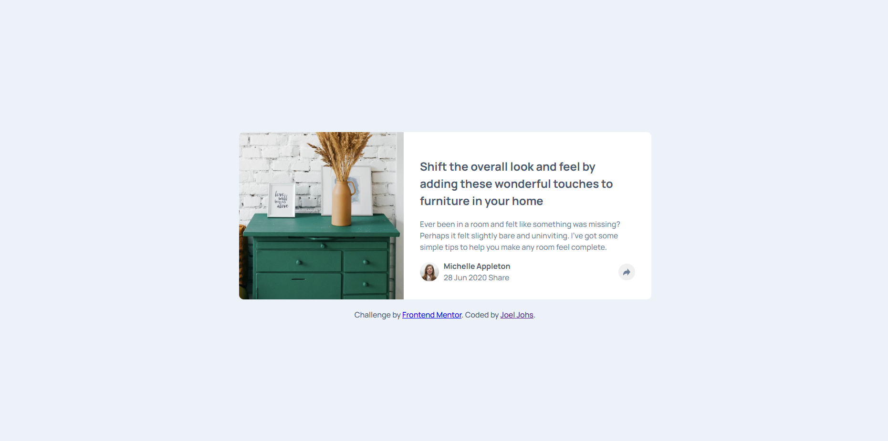
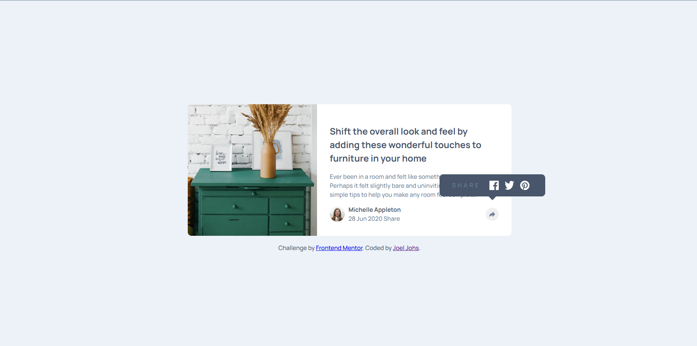
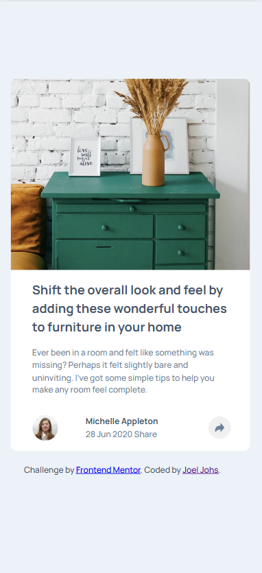
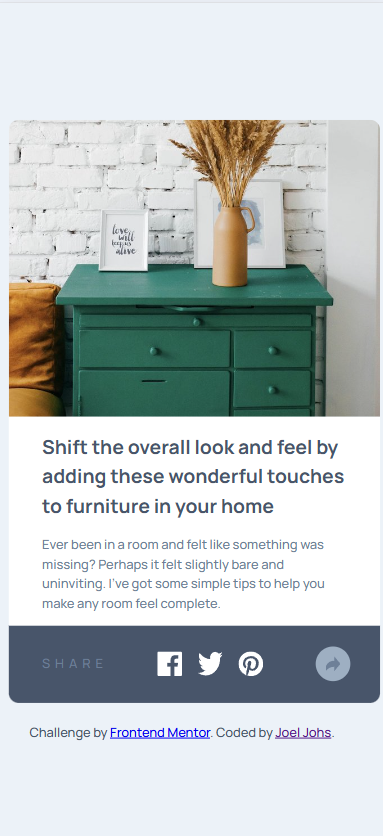

# Frontend Mentor - Article preview component solution

This is a solution to the [Article preview component challenge on Frontend Mentor](https://www.frontendmentor.io/challenges/article-preview-component-dYBN_pYFT). Frontend Mentor challenges help you improve your coding skills by building realistic projects.

## Overview

### Screenshot

### Links

- Solution URL: [GirHub](https://github.com/JoelJohs/frontend-mentor_article-preview-component)
- Live Site URL: [GitHub Pages](/a)

## My process

### Built with

- Semantic HTML5 markup
- CSS custom properties
- Flexbox
- CSS Grid

## Author

- freeCodeCamp - [@JoelJohs](https://www.freecodecamp.org/JoelJohs)
- Frontend Mentor - [@JoelJohs](https://www.frontendmentor.io/profile/JoelJohs)
- GitHub - [JoelJohs](https://github.com/JoelJohs)
